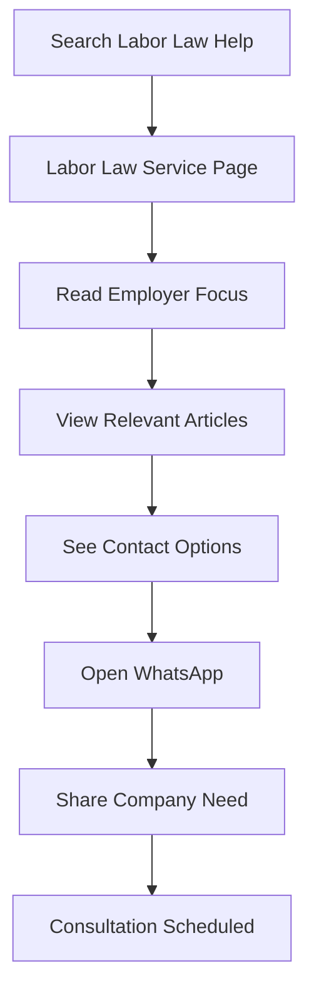
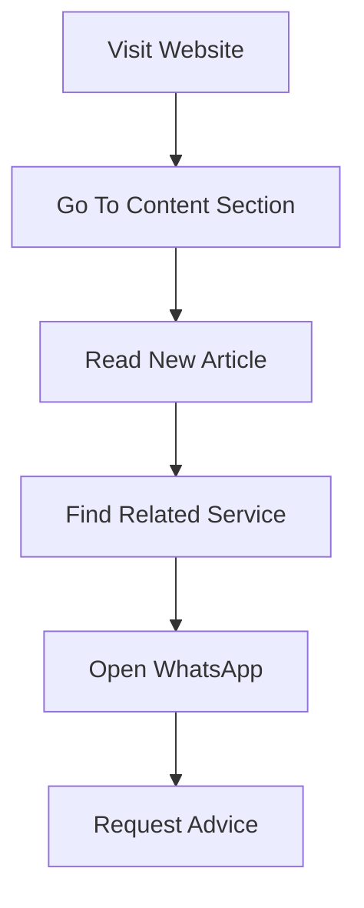

Put the **approved full architecture document** into `docs/system-design.md`.

Use this exact structure:

````md
# Business and Labor Law Firm Website

This website will be a modern legal landing page for existing and prospective clients, designed to generate high value consultations and direct contact. The firm should be positioned first as corporate and premium, with a second layer of warmth and human closeness in negotiation, advisory, and business counseling contexts. The main practice focus is Civil Law / Business Law, especially labor and tax related business matters, while also presenting broader team capabilities in penal, administrative, and family law.

The site should serve two business goals at the same time. First, it should convert visitors into WhatsApp conversations and consultation bookings. Second, it should build long term authority through legal updates, articles, and practical content that supports SEO and AEO in Spanish and English. The site should be easy to update, credible for established companies and foreign investors, and flexible enough to support startups, HR teams, and selected high income individuals.

## User Flows

### Flow 1 New client from Chile looking for business or labor counsel

```mermaid
flowchart TD
  A[Google Search]
  B[Article Or Service Page]
  C[Read Firm Value]
  D[Review Practice Area]
  E[See Trust Signals]
  F[Open WhatsApp]
  G[Send Inquiry]
  H[Consultation Scheduled]

  A --> B
  B --> C
  C --> D
  D --> E
  E --> F
  F --> G
  G --> H
````

### Flow 2 International client evaluating cross border legal counsel

```mermaid
flowchart TD
  A[English Search]
  B[English Landing Page]
  C[Review Business And Tax Focus]
  D[See International Experience]
  E[Read Team Profile]
  F[Open WhatsApp]
  G[Request Meeting]
  H[Calendar Booking]

  A --> B
  B --> C
  C --> D
  D --> E
  E --> F
  F --> G
  G --> H
```

### Flow 3 HR team seeking labor law support



### Flow 4 Existing client checking updates and legal content



## Site Map and Information Architecture

### Main navigation

* Inicio
* Servicios
* Equipo
* Contenido
* Contacto
* ES / EN

### Recommended page structure

**Inicio**
Homepage with positioning, services, trust signals, target client types, and primary CTAs.

**Servicios**
Priority:

* Civil Law / Business Law
* Labor Law
* Tax And Tributes

Secondary:

* Penal Law
* Administrative Law
* Family Law

**Equipo**
Firm, lawyers, bilingual capability, business orientation, and relevant experience.

**Contenido**
Unified content hub for:

* Articles
* Legal updates
* Practical guides
* FAQ style explainers
* Strategic commentary

**Contacto**
Primary WhatsApp CTA, secondary calendar booking, form, contact details, and service area note.

### Supporting pages

**Service detail pages**

* Civil Law / Business Law
* Labor Law
* Tax And Tributes
* Penal Law
* Administrative Law
* Family Law

**High value business subpages**

* Foreign Investment In Chile
* Employer Labor Advisory
* Corporate Compliance
* Contract Drafting And Negotiation
* Tax Controversies Or Tax Advisory
* Business Counsel For Startups

**Conversion support pages**

* Book Consultation
* Thank You Page
* Privacy Policy
* Terms And Conditions

**Content taxonomy pages**

* Labor
* Tax
* Corporate
* Startups
* HR
* Foreign Investors
* Legal Updates
* Guides

### Progressive visibility model

All planned pages and sections should exist in the CMS from the start but remain invisible to the public until they contain published content.

### Bilingual information architecture

Spanish first. English for:

* Homepage
* Main service pages
* Team page
* Contact page
* Selected high value articles and guides

### Navigation behavior

Header includes:

* persistent WhatsApp CTA
* ES / EN switcher
* quick access to Servicios and Contenido

Footer includes:

* service links
* content categories
* contact details
* languages
* legal pages

## Homepage and Conversion Strategy

### Homepage objective

The homepage should establish premium positioning, present the main legal services, and convert qualified visitors through a business focused message for companies, employers, investors, and decision makers.

### Messaging hierarchy

1. Firm identity and premium positioning
2. Main legal services
3. Results oriented business message

### Hero section

Include:

* firm name
* premium headline
* subheadline focused on business and employer needs
* primary WhatsApp CTA
* secondary calendar booking CTA
* optional trust line
* restrained premium imagery or abstract visuals

### Trust signals above the fold

Logo strip directly below hero with:

* Agrícola New Seed
* Chilean Seed
* Colegio Saint George
* Appoderado
* Schoolin1
* Rowsis
* Mejoremos.cl

### Social proof section

Testimonial cards with:

* company logos
* reviewer names and roles
* short explanation of advisory provided

### Recommended homepage sections

1. Hero
2. Logo strip
3. Main services overview
4. Why clients hire the firm
5. Social proof
6. Target client segment block
7. Content and legal updates preview
8. Final conversion section

### Conversion strategy

WhatsApp should appear:

* in the hero
* in the sticky header or floating button
* near service cards
* in the final CTA block

Calendar booking should appear:

* as secondary hero CTA
* on contact page
* on selected high intent service pages

### Tone and copy style

* premium
* precise
* commercially intelligent
* calm under pressure
* human in advisory situations

### Trust and permissions model

Each trust entry should support:

* company name
* logo
* reviewer name
* reviewer role
* testimonial excerpt
* full testimonial
* public visibility toggle
* related service categories

## Practice Areas Structure

### Practice area strategy

Civil Law / Business Law is the flagship service and primary commercial entry point.

### Recommended hierarchy

**Primary flagship**

* Civil Law / Business Law

**Core supporting services**

* Labor Law
* Tax And Tributes

**Secondary services**

* Penal Law
* Administrative Law
* Family Law

### Civil Law / Business Law page structure

* premium opening statement
* key business problems solved
* service categories
* sectors or client types served
* trust signals
* FAQ block
* WhatsApp CTA
* calendar booking CTA
* related articles and guides

**Suggested nested topics**

* commercial contracts
* corporate structuring
* shareholder or partner disputes
* negotiation and conflict prevention
* business advisory
* civil and commercial litigation
* debt recovery if relevant
* risk review for commercial decisions
* cross border business advisory if relevant

### Labor Law page structure

Employer side positioning with:

* labor risk scenarios
* contracts and policies
* disputes and representation
* preventive advisory for HR teams
* related updates
* trust signals
* WhatsApp and booking CTAs

### Tax And Tributes page structure

* tax advisory positioning
* tax structuring and support
* tax risk review
* disputes or proceedings if relevant
* foreign investor support
* business impact framing
* related content and FAQs
* CTA

### Secondary practice pages

Penal, Administrative, and Family pages exist in the CMS from the beginning but can remain unpublished until ready.

### Internal linking strategy

Civil Law / Business Law acts as the central hub linking to Labor Law, Tax And Tributes, and related content.

### Practice area publishing model

Each practice page should support:

* title
* summary
* service description
* target client types
* common scenarios
* FAQ items
* related articles
* related testimonials
* primary CTA
* secondary CTA
* SEO fields for ES and EN
* publish visibility toggle

### Bilingual rollout priority

1. Civil Law / Business Law
2. Labor Law
3. Tax And Tributes
4. Contact page
5. Team page
6. Selected articles
7. Secondary practice areas

## Articles and Legal Updates

### Content strategy objective

Content should primarily serve business decision makers and HR teams, with a secondary stream for high income individuals.

### Content audience priority

**Primary audience**

* established companies
* foreign investors
* startups
* HR teams

**Secondary audience**

* high income individuals with relevant business or strategic legal needs

### Content types

* Legal updates
* Articles
* Guides
* FAQ explainers
* Strategic commentary

### Editorial positioning

Every piece should:

* clarify a legal issue
* demonstrate business judgment
* create a natural path toward consultation

### Main topic clusters

**Civil Law / Business Law**

* commercial contracts
* business disputes
* negotiation strategy
* corporate structuring
* shareholder or partner issues
* civil liability in business settings
* due diligence and business risk review
* foreign investment in Chile

**Labor Law**

* employer obligations
* terminations and labor risk
* internal policies and regulations
* HR compliance
* executive employment issues
* inspections and sanctions
* labor litigation prevention
* common employer mistakes

**Tax And Tributes**

* business tax considerations
* tax risk and compliance
* restructuring implications
* tax guidance for companies
* investor tax concerns
* administrative tax disputes if relevant

### Publishing model

Launch with:

* pillar service pages first
* a small set of evergreen guides
* recurring legal updates
* FAQs attached to major service pages
* selected English translations for high value topics

### Recommended content structure per article

* title
* short summary
* author
* publish date
* updated date
* audience tag
* practice area tag
* content type
* featured image optional
* related service page
* related CTA
* FAQ block optional
* language version
* SEO title and meta description
* visibility toggle

### Content and conversion connection

Every content piece should link naturally to a service page and contact path.

### AEO oriented approach

Structure content around direct user questions and business scenarios.

### English content strategy

Focus first on:

* foreign investment
* business law in Chile
* employer side labor guidance
* selected tax topics
* contact and team pages

### Editorial governance

* draft
* legal review
* brand tone review
* publish approval
* optional translation review
* scheduled update review

## SEO and AEO Strategy

### SEO strategy objective

Prioritize specific cities and regions, with strongest focus from Concepción to Puerto Montt.

### Geographic targeting model

**Core regional corridor**

* Concepción
* Los Ángeles
* Temuco
* Valdivia
* Osorno
* Puerto Varas
* Puerto Montt

**Wider southern Chile**

* Biobío
* La Araucanía
* Los Ríos
* Los Lagos

**Support layer**

* Chile wide visibility
* English pages for international clients

### Localized service landing pages

Examples:

* abogado de empresas en Concepción
* abogado laboral para empresas en Temuco
* asesoría legal corporativa en Valdivia
* abogado tributario para empresas en Puerto Montt
* asesoría para inversionistas extranjeros en el sur de Chile

### Regional content cluster strategy

Examples:

* labor law updates for employers in southern Chile
* legal considerations for companies expanding in Los Lagos
* contract risks for agricultural or export businesses in the south
* tax and restructuring issues for regional companies
* employer compliance guides for HR teams in Biobío and La Araucanía

### Pillar and cluster model

**Pillar pages**

* Civil Law / Business Law
* Labor Law
* Tax And Tributes
* Foreign Investment In Chile
* Employer Labor Advisory

**Cluster pages**

* city specific service pages
* FAQs
* guides
* updates
* industry or sector content
* targeted articles

### AEO strategy

Use:

* FAQ sections
* concise direct answers
* clear search style headings
* schema ready content
* strong summaries

### On page SEO structure

Support:

* keyword focused title
* localized meta title and description
* clear H1
* strong H2/H3
* internal links
* FAQ block
* conversion CTA
* bilingual SEO fields

### Content taxonomy for SEO

Organize by:

* practice area
* audience type
* city or region relevance
* content type
* language
* sector if needed later

### Local credibility signals

Use:

* city and region references
* client proof
* bilingual advisory support
* consistent contact information
* service area language

### English SEO strategy

Focus on:

* business law in Chile
* labor law for employers in Chile
* legal counsel for foreign investors
* tax and corporate advisory in Chile

### Technical SEO priorities

* fast page loads
* clean URL structure
* strong internal linking
* XML sitemap
* canonical handling
* hreflang
* structured data
* index control
* image optimization
* breadcrumbs

### Measurement priorities

* rankings for city plus service queries
* organic leads by city and practice area
* article to consultation conversion
* visibility growth in southern Chile
* traffic to flagship and local pages
* WhatsApp clicks from organic traffic

## Content Management and Update Workflow

### Workflow objective

The system should be optimized for a single primary operator and support AI assisted drafting with human review.

### Recommended workflow design

1. Topic selection
2. Content brief generation
3. Draft generation
4. Human legal review
5. CMS formatting
6. Publish or schedule
7. Update later if needed

### Required CMS capabilities

* create and edit pages without code
* create articles and updates quickly
* duplicate content as templates
* assign categories and audience tags
* connect articles to service pages
* add FAQ blocks
* control ES and EN separately
* hide unpublished or incomplete pages
* manage testimonials and logos
* edit SEO title and meta description
* schedule content
* preview before publishing

### Recommended content statuses

* Idea
* Draft
* Reviewed
* Published
* Needs Update

### AI assisted editorial workflow

Use AI as a drafting engine, not an unsupervised publisher.

### Base content brief template

```text
CONTENT BRIEF

Primary objective:
Generate qualified legal leads for the firm.

Primary audience:
Choose one: established companies / foreign investors / startups / HR teams / high income individuals.

Secondary audience:
Optional.

Primary service linked to this content:
Choose one service page.

Search intent:
Choose one: informational / commercial informational / high intent consultation.

Primary keyword:
Insert exact target keyword.

Secondary keywords:
Insert 5 to 10 related phrases.

Geographic focus:
Choose one or more cities or regions from Concepción to Puerto Montt if relevant.

Language:
Spanish or English.

Content type:
Choose one: legal update / article / guide / FAQ / commentary.

Desired tone:
Corporate premium clear commercially intelligent practical calm.

Desired length:
Choose target word count range.

Main business problem:
What problem is the reader trying to solve.

Desired CTA:
WhatsApp first / calendar second.

AEO questions to answer:
List 3 to 5 exact user questions.

Internal links:
List related service page and 2 to 4 related articles.

Trust element to include:
Relevant testimonial company sector or client type if applicable.

Notes:
Any legal nuance or current development that must be included.
```

### Base AI generation script

```text
Act as a senior legal content strategist for a premium bilingual law firm in Chile focused on Civil Law Business Law Labor Law and Tax And Tributes.

Your task is to write a high conversion legal content piece designed to attract qualified clients, improve SEO and AEO visibility, and naturally guide readers toward contacting the firm by WhatsApp.

Follow these rules strictly:

1. Write for this audience: [INSERT PRIMARY AUDIENCE].
2. The reader is located in: [INSERT CITY REGION OR SOUTHERN CHILE FOCUS].
3. The main service connected to this article is: [INSERT SERVICE].
4. The primary keyword is: [INSERT PRIMARY KEYWORD].
5. Secondary keywords are: [INSERT SECONDARY KEYWORDS].
6. The search intent is: [INSERT SEARCH INTENT].
7. The content type is: [INSERT ARTICLE GUIDE FAQ UPDATE].
8. The tone must be corporate premium clear practical commercially intelligent and trustworthy.
9. The article must be written in [INSERT LANGUAGE].
10. The article must be designed to convert readers into leads without sounding pushy.

Output structure:
- SEO title
- Meta description
- H1
- Short executive summary of 2 to 3 sentences
- Main body with H2 and H3 headings
- Direct answers to the most likely client questions
- A short FAQ section with 4 to 6 questions
- A conclusion with a WhatsApp focused CTA and secondary calendar booking CTA
- Suggested internal links
- Suggested slug
- Suggested excerpt
```

### Title generation script

```text
Generate 20 legal content titles for a premium Chilean law firm.

Audience: [INSERT AUDIENCE]
Primary service: [INSERT SERVICE]
Primary keyword: [INSERT KEYWORD]
Geographic focus: [INSERT LOCATION IF ANY]
Language: [INSERT LANGUAGE]

Rules:
- Prioritize commercially useful search intent
- Mix article guide FAQ and update styles
- Make titles sound credible and premium
- Avoid clickbait
- Make at least 5 titles highly specific to business decision makers or HR teams
- Make at least 5 titles suitable for AEO style questions
- Output only the titles
```

### Content quality checklist

* audience obvious in first paragraph
* business problem clear
* linked service page relevant
* geographic signal present if needed
* tone premium and practical
* direct answer for AEO visibility
* CTA present and natural
* internal links included
* no empty filler
* sounds like guidance for a real client

### Recommended publishing cadence

* 1 evergreen guide per week or every two weeks
* 1 to 2 short legal updates per week when relevant
* ongoing FAQ additions
* selective English publication

### Reuse and scaling model

Repurpose one topic into:

* one full guide
* one shorter update
* one FAQ block
* one LinkedIn style summary if used later
* one English version if justified

### Approval rule

Nothing goes live without final human review.

## Contact and Consultation Booking

### Contact strategy objective

Reduce friction with WhatsApp as the primary action and calendar booking as secondary.

### Primary conversion path

* visitor understands relevance
* visitor sees trust signals
* visitor clicks WhatsApp
* visitor starts general chat
* matter is qualified manually
* consultation is scheduled if appropriate

### WhatsApp implementation model

WhatsApp should appear in:

* hero
* sticky header
* floating button
* service pages
* article conclusion blocks
* contact page
* final CTA blocks

### Calendar booking role

Secondary option on:

* hero
* contact page
* high intent service pages
* selected high intent articles

### Contact page structure

1. Intro block
2. Primary WhatsApp CTA
3. Secondary calendar CTA
4. Contact form
5. Direct contact details
6. Service area note
7. Trust insert

### Contact form fields

* name
* email
* phone optional
* company
* message
* preferred contact method

### Qualification strategy

WhatsApp opens one general chat, with no page specific prefilled variants.

### Contact CTAs by page type

Homepage, service pages, articles, and contact page all route to the same general WhatsApp contact.

### Conversion trust support

Pair CTAs with:

* short trust statements
* tasteful client logos
* testimonial excerpt
* bilingual support note
* service area mention

### Tracking model

Track:

* WhatsApp clicks by page
* booking clicks by page
* form submissions
* article to contact path
* service page to contact path

## Trust Signals and Firm Positioning

### Positioning objective

Premium business oriented legal advisor with strong judgment, practical strategy, and close client involvement.

### Primary trust signals to feature now

1. Client logos
2. Testimonials
3. Biography
4. Years of experience

### Biography strategy

Biography should communicate:

* business oriented legal approach
* experience advising companies and decision makers
* bilingual capability
* Chilean and international client experience
* judgment in negotiation, disputes, advisory, and commercial matters
* relevance to southern Chile

### Years of experience presentation

Display as a clean trust metric, easy to update in CMS.

### Future hidden credibility sections

Create hidden CMS ready sections for:

* Media appearances
* Publications
* Notable cases

### Homepage trust composition

* logo strip
* compact biography or founder statement
* selected testimonials
* concise experience markers
* strong final CTA with trust insert nearby

### Equipo page trust composition

* full professional bio
* years of experience
* business law and labor focus
* bilingual capability
* regional and international client relevance
* selected testimonials or proof snippets
* future ready hidden sections

### Structured trust content model

Support:

* biography blocks
* years of experience field
* testimonials
* logos
* media appearance entries
* publication entries
* notable case entries
* visibility toggle for each trust element

### Positioning language guidelines

Signal:

* premium
* strategic
* commercially intelligent
* close to the client
* practical and business aware
* bilingual and internationally comfortable
* regionally grounded in southern Chile

### Confidentiality and discretion rule

All trust content must respect discretion and only be published when appropriate.

## Technical Architecture

### Recommended architecture

* Next.js for website frontend
* Sanity as visual CMS
* Vercel for hosting and deployment
* Cloudflare later if needed

### Why this is the right fit

Supports:

* modern visual editing
* low maintenance
* structured content growth
* strong SEO control
* custom premium frontend

### Frontend architecture

Templates for:

* homepage
* services hub
* service detail pages
* location pages
* content hub
* article and guide pages
* team page
* contact page
* legal pages

### CMS content model

Include:

* global settings
* homepage sections
* navigation
* service pages
* location pages
* articles
* updates
* guides
* FAQs
* testimonials
* client logos
* biography blocks
* trust metrics
* contact settings
* languages
* hidden future sections

### Visual editing model

* live preview
* draft mode
* scheduled publishing
* easy media replacement
* visibility toggles

### Bilingual architecture

Support:

* Spanish version
* English version
* language specific SEO fields
* per language publication control

### SEO and performance architecture

* server rendered or statically optimized delivery where appropriate
* optimized metadata
* schema ready content
* image optimization
* sitemap
* hreflang
* redirect management
* clean slugs
* noindex controls

### Integrations

* WhatsApp general chat link
* calendar booking
* analytics
* form delivery service
* optional email notification

### Security and maintenance model

* code in version control
* managed hosting
* managed CMS
* minimal plugin dependency surface
* minimal custom backend logic

### Scalability path

Future support for:

* more lawyers
* more service pages
* more cities
* more articles
* lead magnets
* media appearances
* publications
* case summaries
* CRM integration

## Analytics and Lead Tracking

### Analytics objective

Use simple launch analytics focused on business signals.

### Recommended analytics stack

* Google Analytics
* Google Search Console

### What to track in Google Analytics

**Primary conversion events**

* WhatsApp click
* calendar booking click
* contact form submission

**Secondary engagement events**

* click on phone number
* click on email
* scroll depth
* outbound clicks when relevant
* language switch usage
* article to service page click
* article to WhatsApp click

### Page groups to monitor

* homepage
* flagship service page
* other service pages
* location pages
* article and guide pages
* contact page
* team page
* Spanish pages
* English pages

### What to monitor in Search Console

* impressions for city plus service queries
* clicks for business law and labor law queries
* indexing health
* sitemap coverage
* keyword growth by region
* top performing content pages
* high impression low CTR pages

### Conversion interpretation model

**Acquisition**

* organic search
* direct traffic
* referral traffic
* international traffic where relevant

**Behavior**

* most visited service pages
* most visited content pages
* best performing city or regional pages
* engagement by language

**Conversion**

* WhatsApp clicks
* booking clicks
* form submissions
* top pages assisting conversions

### SEO and content feedback loop

Use analytics to improve:

* CTA placement
* internal links
* titles and meta descriptions
* service page trust signals
* English content priorities

### Suggested dashboard priorities

* pages generating most WhatsApp clicks
* articles contributing to consultations
* services attracting most organic traffic
* best performing cities and regions
* Spanish versus English conversion differences

### Tracking architecture notes

Use:

* clear event naming
* consistent tagging
* page context on conversions
* separate tracking by page type and section

## Deployment and Maintenance

### Deployment objective

Support both:

* public production site
* safe staging preview environment

### Environment model

**Production**

* live public website
* production CMS dataset
* published content only

**Staging preview**

* private or protected review site
* draft and preview content
* used for review before release

### Deployment workflow

1. Content or design change created
2. Preview in staging
3. Approve
4. Deploy or publish to production

### Production deployment model

* managed hosting
* main domain
* optimized for SEO and performance
* controlled publishes and code deployments

### Staging preview model

Must support:

* draft preview
* Spanish and English review
* hidden section validation
* testimonial and logo checks
* service and location template review
* CTA and analytics validation

Staging must not be indexed.

### Maintenance model

Ongoing responsibilities:

* publish and update content
* review staging before key changes
* occasional dependency updates
* check forms, analytics, and contact flows
* review Search Console
* keep trust content current

### Content publishing maintenance

* draft in CMS
* preview in staging
* publish
* verify live page
* review analytics later

### Technical maintenance responsibilities

Periodic checks for:

* CMS health
* hosting status
* broken links
* form delivery
* analytics event firing
* sitemap status
* language routing
* preview health

### Backup and recovery stance

Rely on:

* version controlled code
* hosting rollback capability
* CMS revision history
* separate environments

### Maintenance priority principle

The site should grow mostly through content changes, not code changes.

## Assumptions

* The site is a legal services website, not an online store.
* Primary audience is existing and prospective clients in Chile.
* The site also supports international prospects through English pages.
* Spanish is primary, English is secondary.
* Main business focus is Civil Law / Business Law, with strongest emphasis on labor and tax related business matters.
* Other practice areas remain visible but secondary.
* Labor Law appears before Tax And Tributes.
* Family Law appears last among secondary practice areas.
* Primary CTA is WhatsApp.
* Secondary CTA is calendar booking.
* WhatsApp opens a general chat rather than page specific prefilled variants.
* Brand tone is corporate and premium first, then close and human.
* Highest priority client segments are established companies, foreign investors, startups, and HR teams, in that order.
* High income individuals are a secondary audience.
* Articles and legal updates live under one unified content section.
* Planned pages and submenus exist in the CMS but remain hidden until published.
* The site should be easy for one main operator to update.
* Launch stack is Next.js plus Sanity plus Vercel.
* Launch analytics stack is Google Analytics plus Google Search Console.
* Deployment includes both production and non indexed staging preview.

```
